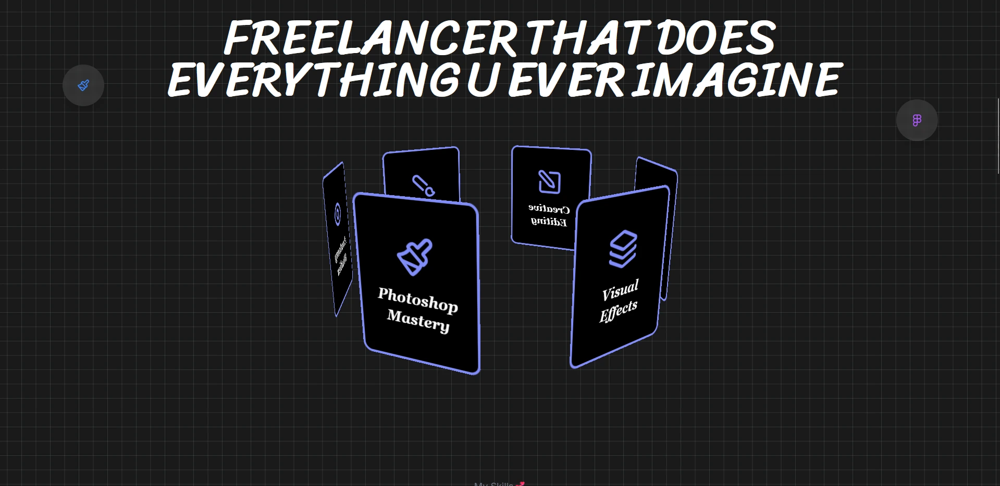

# Kit Art Studio

Welcome to the GitHub repository for **Kit Art Studio**, an artistic showcase site for Kitchan's artwork! This project is a modern, interactive web application designed to highlight creativity and style.

## 🌟 Features
- **Dynamic Animations:** Powered by GSAP for smooth and visually appealing animations.
- **Elegant Scrolling:** Integrated Lenis for buttery-smooth scrolling experiences.
- **Responsive Design:** Built with Tailwind CSS to ensure compatibility across devices.
- **React Components:** Modular and reusable components for seamless development.
- **Fast Loading:** Optimized for performance to provide a delightful user experience.

---

## 🛠️ Technologies Used

Below are the technologies and tools used to build this project:

| Technology | Description |
|------------|-------------|
|  | JavaScript library for building user interfaces. |
|  | Utility-first CSS framework. |
|  | Animation library for creating engaging web experiences. |
|  | Smooth scroll library for delightful user experiences. |

---

## 🚀 Getting Started

### Prerequisites
Make sure you have the following installed on your machine:

- **Node.js** (v16 or above)
- **npm** or **yarn**

### Installation

1. Clone the repository:
   ```bash
   git clone https://github.com/username/kit-art-studio.git
   ```

2. Navigate to the project directory:
   ```bash
   cd kit-art-studio
   ```

3. Install dependencies:
   ```bash
   npm install
   # or
   yarn install
   ```

4. Run the development server:
   ```bash
   npm run dev
   # or
   yarn dev
   ```

5. Open your browser and visit:
   ```
   http://localhost:3000
   ```

---

## 📸 Screenshots

### Home Page


### Artwork Showcase


### 3D Skill Card Effect


---

## 🌈 Contributions
 For major changes, please open an issue first to discuss what you would like to change.

---

## 🔗 Live Demo
Check out the live prototype here: [Kit Art Studio](https://kit-art-studio.vercel.app/)

---

